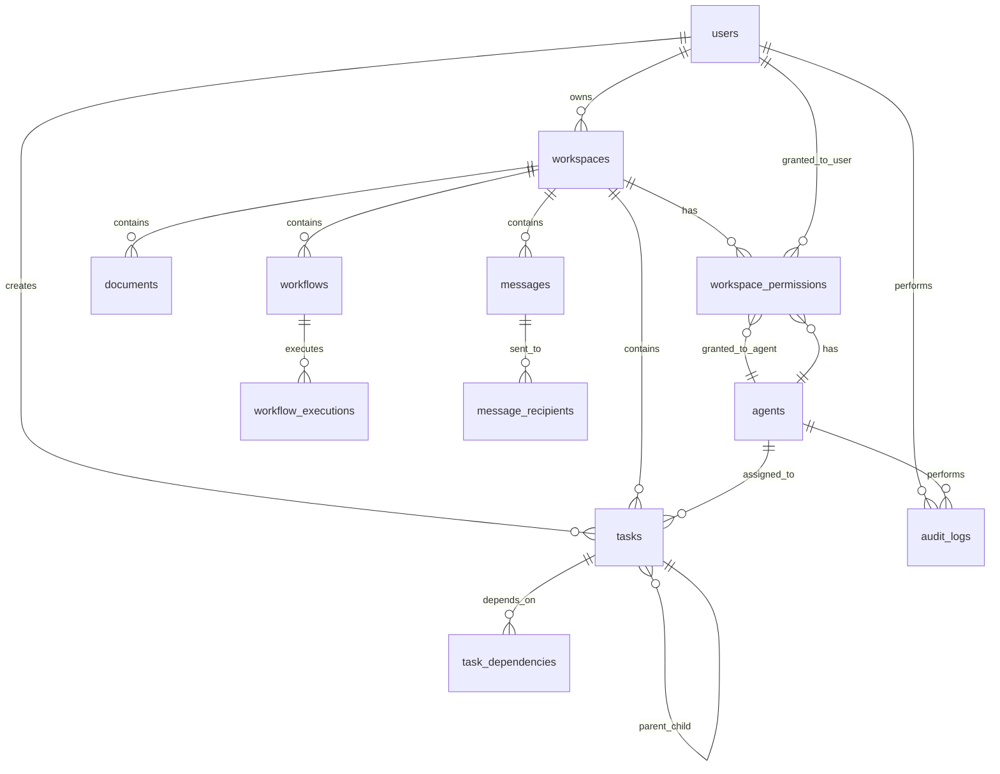

# 基于LLM的多智能体并行协作系统 - 数据库Schema设计

## 1. 数据库概述

### 1.1 数据库选择
- **主数据库**: PostgreSQL 15+
- **缓存数据库**: Redis 7+
- **文件存储**: MinIO / AWS S3

### 1.2 设计原则
- **规范化设计**: 减少数据冗余
- **性能优化**: 合理索引和分区
- **扩展性**: 支持水平扩展
- **安全性**: 敏感数据加密

## 2. 核心表结构

### 2.1 用户表 (users)

```sql
CREATE TABLE users (
    id UUID PRIMARY KEY DEFAULT gen_random_uuid(),
    username VARCHAR(255) UNIQUE NOT NULL,
    email VARCHAR(255) UNIQUE NOT NULL,
    password_hash VARCHAR(255) NOT NULL,
    full_name VARCHAR(255),
    avatar_url TEXT,
    is_active BOOLEAN DEFAULT TRUE,
    is_superuser BOOLEAN DEFAULT FALSE,
    last_login TIMESTAMPTZ,
    created_at TIMESTAMPTZ DEFAULT NOW(),
    updated_at TIMESTAMPTZ DEFAULT NOW()
);

-- 索引
CREATE INDEX idx_users_email ON users(email);
CREATE INDEX idx_users_username ON users(username);
CREATE INDEX idx_users_created_at ON users(created_at);
```

### 2.2 工作空间表 (workspaces)

```sql
CREATE TABLE workspaces (
    id UUID PRIMARY KEY DEFAULT gen_random_uuid(),
    name VARCHAR(255) NOT NULL,
    description TEXT,
    owner_id UUID NOT NULL REFERENCES users(id) ON DELETE CASCADE,
    is_public BOOLEAN DEFAULT FALSE,
    context JSONB DEFAULT '{}',
    metadata JSONB DEFAULT '{}',
    created_at TIMESTAMPTZ DEFAULT NOW(),
    updated_at TIMESTAMPTZ DEFAULT NOW()
);

-- 索引
CREATE INDEX idx_workspaces_owner_id ON workspaces(owner_id);
CREATE INDEX idx_workspaces_created_at ON workspaces(created_at);
CREATE INDEX idx_workspaces_context ON workspaces USING GIN(context);
CREATE INDEX idx_workspaces_metadata ON workspaces USING GIN(metadata);
```

### 2.3 工作空间权限表 (workspace_permissions)

```sql
CREATE TABLE workspace_permissions (
    id UUID PRIMARY KEY DEFAULT gen_random_uuid(),
    workspace_id UUID NOT NULL REFERENCES workspaces(id) ON DELETE CASCADE,
    user_id UUID REFERENCES users(id) ON DELETE CASCADE,
    agent_id UUID REFERENCES agents(id) ON DELETE CASCADE,
    permission_level VARCHAR(50) NOT NULL CHECK (
        permission_level IN ('read', 'write', 'admin')
    ),
    granted_by UUID NOT NULL REFERENCES users(id),
    granted_at TIMESTAMPTZ DEFAULT NOW(),
    expires_at TIMESTAMPTZ,
    
    -- 确保每个权限条目只关联用户或智能体之一
    CHECK (
        (user_id IS NOT NULL AND agent_id IS NULL) OR 
        (user_id IS NULL AND agent_id IS NOT NULL)
    )
);

-- 索引
CREATE INDEX idx_workspace_perms_workspace_id ON workspace_permissions(workspace_id);
CREATE INDEX idx_workspace_perms_user_id ON workspace_permissions(user_id);
CREATE INDEX idx_workspace_perms_agent_id ON workspace_permissions(agent_id);
CREATE UNIQUE INDEX idx_workspace_perms_unique_user ON 
    workspace_permissions(workspace_id, user_id) WHERE user_id IS NOT NULL;
CREATE UNIQUE INDEX idx_workspace_perms_unique_agent ON 
    workspace_permissions(workspace_id, agent_id) WHERE agent_id IS NOT NULL;
```

### 2.4 智能体表 (agents)

```sql
CREATE TABLE agents (
    id UUID PRIMARY KEY DEFAULT gen_random_uuid(),
    name VARCHAR(255) NOT NULL,
    description TEXT,
    status VARCHAR(50) NOT NULL DEFAULT 'OFFLINE' CHECK (
        status IN ('ONLINE', 'OFFLINE', 'BUSY', 'IDLE', 'ERROR')
    ),
    capabilities JSONB NOT NULL DEFAULT '[]',
    endpoints JSONB NOT NULL DEFAULT '{}',
    limits JSONB NOT NULL DEFAULT '{}',
    current_load INTEGER DEFAULT 0,
    max_concurrent_tasks INTEGER DEFAULT 5,
    last_heartbeat TIMESTAMPTZ,
    metadata JSONB DEFAULT '{}',
    created_at TIMESTAMPTZ DEFAULT NOW(),
    updated_at TIMESTAMPTZ DEFAULT NOW()
);

-- 索引
CREATE INDEX idx_agents_status ON agents(status);
CREATE INDEX idx_agents_capabilities ON agents USING GIN(capabilities);
CREATE INDEX idx_agents_last_heartbeat ON agents(last_heartbeat);
CREATE INDEX idx_agents_created_at ON agents(created_at);
```

### 2.5 任务表 (tasks)

```sql
CREATE TABLE tasks (
    id UUID PRIMARY KEY DEFAULT gen_random_uuid(),
    title VARCHAR(500) NOT NULL,
    description TEXT,
    status VARCHAR(50) NOT NULL DEFAULT 'PENDING' CHECK (
        status IN ('PENDING', 'IN_PROGRESS', 'COMPLETED', 'FAILED', 'CANCELLED')
    ),
    priority VARCHAR(20) NOT NULL DEFAULT 'MEDIUM' CHECK (
        priority IN ('LOW', 'MEDIUM', 'HIGH', 'URGENT')
    ),
    parent_task_id UUID REFERENCES tasks(id) ON DELETE SET NULL,
    workspace_id UUID NOT NULL REFERENCES workspaces(id) ON DELETE CASCADE,
    assigned_agent_id UUID REFERENCES agents(id) ON DELETE SET NULL,
    created_by UUID NOT NULL REFERENCES users(id),
    
    -- 任务要求
    requirements JSONB NOT NULL DEFAULT '{}',
    
    -- 执行上下文
    context JSONB DEFAULT '{}',
    
    -- 执行结果
    result JSONB,
    
    -- 进度和指标
    progress INTEGER DEFAULT 0 CHECK (progress >= 0 AND progress <= 100),
    current_step VARCHAR(255),
    estimated_completion TIMESTAMPTZ,
    
    -- 执行统计
    started_at TIMESTAMPTZ,
    completed_at TIMESTAMPTZ,
    execution_time INTEGER, -- 执行时间(秒)
    retry_count INTEGER DEFAULT 0,
    
    -- 元数据
    metadata JSONB DEFAULT '{}',
    
    created_at TIMESTAMPTZ DEFAULT NOW(),
    updated_at TIMESTAMPTZ DEFAULT NOW()
);

-- 索引
CREATE INDEX idx_tasks_status ON tasks(status);
CREATE INDEX idx_tasks_priority ON tasks(priority);
CREATE INDEX idx_tasks_parent_task_id ON tasks(parent_task_id);
CREATE INDEX idx_tasks_workspace_id ON tasks(workspace_id);
CREATE INDEX idx_tasks_assigned_agent_id ON tasks(assigned_agent_id);
CREATE INDEX idx_tasks_created_by ON tasks(created_by);
CREATE INDEX idx_tasks_created_at ON tasks(created_at);
CREATE INDEX idx_tasks_requirements ON tasks USING GIN(requirements);
CREATE INDEX idx_tasks_context ON tasks USING GIN(context);
CREATE INDEX idx_tasks_metadata ON tasks USING GIN(metadata);
```

### 2.6 任务依赖表 (task_dependencies)

```sql
CREATE TABLE task_dependencies (
    id UUID PRIMARY KEY DEFAULT gen_random_uuid(),
    task_id UUID NOT NULL REFERENCES tasks(id) ON DELETE CASCADE,
    depends_on_task_id UUID NOT NULL REFERENCES tasks(id) ON DELETE CASCADE,
    dependency_type VARCHAR(50) DEFAULT 'BLOCKING' CHECK (
        dependency_type IN ('BLOCKING', 'NON_BLOCKING')
    ),
    created_at TIMESTAMPTZ DEFAULT NOW(),
    
    -- 防止循环依赖
    CHECK (task_id != depends_on_task_id)
);

-- 索引
CREATE INDEX idx_task_deps_task_id ON task_dependencies(task_id);
CREATE INDEX idx_task_deps_depends_on_id ON task_dependencies(depends_on_task_id);
CREATE UNIQUE INDEX idx_task_deps_unique ON 
    task_dependencies(task_id, depends_on_task_id);
```

### 2.7 工作流表 (workflows)

```sql
CREATE TABLE workflows (
    id UUID PRIMARY KEY DEFAULT gen_random_uuid(),
    name VARCHAR(255) NOT NULL,
    description TEXT,
    status VARCHAR(50) NOT NULL DEFAULT 'DRAFT' CHECK (
        status IN ('DRAFT', 'ACTIVE', 'INACTIVE', 'ARCHIVED')
    ),
    definition JSONB NOT NULL,
    created_by UUID NOT NULL REFERENCES users(id),
    workspace_id UUID NOT NULL REFERENCES workspaces(id) ON DELETE CASCADE,
    metadata JSONB DEFAULT '{}',
    created_at TIMESTAMPTZ DEFAULT NOW(),
    updated_at TIMESTAMPTZ DEFAULT NOW()
);

-- 索引
CREATE INDEX idx_workflows_status ON workflows(status);
CREATE INDEX idx_workflows_created_by ON workflows(created_by);
CREATE INDEX idx_workflows_workspace_id ON workflows(workspace_id);
CREATE INDEX idx_workflows_definition ON workflows USING GIN(definition);
```

### 2.8 工作流执行表 (workflow_executions)

```sql
CREATE TABLE workflow_executions (
    id UUID PRIMARY KEY DEFAULT gen_random_uuid(),
    workflow_id UUID NOT NULL REFERENCES workflows(id) ON DELETE CASCADE,
    status VARCHAR(50) NOT NULL DEFAULT 'PENDING' CHECK (
        status IN ('PENDING', 'RUNNING', 'COMPLETED', 'FAILED', 'CANCELLED')
    ),
    input_data JSONB DEFAULT '{}',
    output_data JSONB,
    progress INTEGER DEFAULT 0 CHECK (progress >= 0 AND progress <= 100),
    current_step VARCHAR(255),
    started_at TIMESTAMPTZ,
    completed_at TIMESTAMPTZ,
    total_execution_time INTEGER,
    error_message TEXT,
    metadata JSONB DEFAULT '{}',
    created_at TIMESTAMPTZ DEFAULT NOW(),
    updated_at TIMESTAMPTZ DEFAULT NOW()
);

-- 索引
CREATE INDEX idx_wf_executions_workflow_id ON workflow_executions(workflow_id);
CREATE INDEX idx_wf_executions_status ON workflow_executions(status);
CREATE INDEX idx_wf_executions_created_at ON workflow_executions(created_at);
```

### 2.9 文档表 (documents)

```sql
CREATE TABLE documents (
    id UUID PRIMARY KEY DEFAULT gen_random_uuid(),
    workspace_id UUID NOT NULL REFERENCES workspaces(id) ON DELETE CASCADE,
    name VARCHAR(255) NOT NULL,
    file_name VARCHAR(255),
    file_type VARCHAR(100),
    file_size BIGINT,
    storage_url TEXT,
    content_type VARCHAR(100),
    content_hash VARCHAR(64), -- SHA256 hash
    metadata JSONB DEFAULT '{}',
    uploaded_by UUID NOT NULL REFERENCES users(id),
    created_at TIMESTAMPTZ DEFAULT NOW(),
    updated_at TIMESTAMPTZ DEFAULT NOW()
);

-- 索引
CREATE INDEX idx_documents_workspace_id ON documents(workspace_id);
CREATE INDEX idx_documents_file_type ON documents(file_type);
CREATE INDEX idx_documents_uploaded_by ON documents(uploaded_by);
CREATE INDEX idx_documents_created_at ON documents(created_at);
```

### 2.10 消息表 (messages)

```sql
CREATE TABLE messages (
    id UUID PRIMARY KEY DEFAULT gen_random_uuid(),
    workspace_id UUID NOT NULL REFERENCES workspaces(id) ON DELETE CASCADE,
    sender_id UUID NOT NULL, -- 可以是用户ID或智能体ID
    sender_type VARCHAR(20) NOT NULL CHECK (sender_type IN ('USER', 'AGENT')),
    message_type VARCHAR(50) NOT NULL CHECK (
        message_type IN (
            'TASK_ASSIGNMENT', 'STATUS_UPDATE', 'COLLABORATION_REQUEST',
            'INFORMATION_SHARING', 'ERROR_REPORT', 'SYSTEM_NOTIFICATION'
        )
    ),
    content JSONB NOT NULL,
    priority VARCHAR(20) DEFAULT 'NORMAL' CHECK (
        priority IN ('LOW', 'NORMAL', 'HIGH', 'URGENT')
    ),
    is_read BOOLEAN DEFAULT FALSE,
    expires_at TIMESTAMPTZ,
    metadata JSONB DEFAULT '{}',
    created_at TIMESTAMPTZ DEFAULT NOW()
);

-- 索引
CREATE INDEX idx_messages_workspace_id ON messages(workspace_id);
CREATE INDEX idx_messages_sender ON messages(sender_id, sender_type);
CREATE INDEX idx_messages_type ON messages(message_type);
CREATE INDEX idx_messages_priority ON messages(priority);
CREATE INDEX idx_messages_created_at ON messages(created_at);
CREATE INDEX idx_messages_is_read ON messages(is_read);
```

### 2.11 消息接收者表 (message_recipients)

```sql
CREATE TABLE message_recipients (
    id UUID PRIMARY KEY DEFAULT gen_random_uuid(),
    message_id UUID NOT NULL REFERENCES messages(id) ON DELETE CASCADE,
    recipient_id UUID NOT NULL, -- 可以是用户ID或智能体ID
    recipient_type VARCHAR(20) NOT NULL CHECK (recipient_type IN ('USER', 'AGENT')),
    delivered_at TIMESTAMPTZ,
    read_at TIMESTAMPTZ,
    delivery_status VARCHAR(20) DEFAULT 'PENDING' CHECK (
        delivery_status IN ('PENDING', 'DELIVERED', 'FAILED')
    ),
    created_at TIMESTAMPTZ DEFAULT NOW()
);

-- 索引
CREATE INDEX idx_msg_recipients_message_id ON message_recipients(message_id);
CREATE INDEX idx_msg_recipients_recipient ON message_recipients(recipient_id, recipient_type);
CREATE INDEX idx_msg_recipients_delivery_status ON message_recipients(delivery_status);
```

### 2.12 工具表 (tools)

```sql
CREATE TABLE tools (
    id UUID PRIMARY KEY DEFAULT gen_random_uuid(),
    name VARCHAR(255) NOT NULL,
    description TEXT,
    category VARCHAR(100),
    endpoint_url TEXT,
    authentication_type VARCHAR(50) DEFAULT 'NONE' CHECK (
        authentication_type IN ('NONE', 'API_KEY', 'OAUTH2', 'BEARER_TOKEN')
    ),
    authentication_config JSONB,
    parameters_schema JSONB,
    capabilities JSONB DEFAULT '[]',
    is_active BOOLEAN DEFAULT TRUE,
    rate_limit_per_minute INTEGER DEFAULT 60,
    metadata JSONB DEFAULT '{}',
    created_at TIMESTAMPTZ DEFAULT NOW(),
    updated_at TIMESTAMPTZ DEFAULT NOW()
);

-- 索引
CREATE INDEX idx_tools_category ON tools(category);
CREATE INDEX idx_tools_is_active ON tools(is_active);
CREATE INDEX idx_tools_capabilities ON tools USING GIN(capabilities);
```

### 2.13 审计日志表 (audit_logs)

```sql
CREATE TABLE audit_logs (
    id UUID PRIMARY KEY DEFAULT gen_random_uuid(),
    user_id UUID REFERENCES users(id) ON DELETE SET NULL,
    agent_id UUID REFERENCES agents(id) ON DELETE SET NULL,
    action VARCHAR(100) NOT NULL,
    resource_type VARCHAR(100) NOT NULL,
    resource_id UUID,
    details JSONB DEFAULT '{}',
    ip_address INET,
    user_agent TEXT,
    created_at TIMESTAMPTZ DEFAULT NOW()
);

-- 索引
CREATE INDEX idx_audit_logs_user_id ON audit_logs(user_id);
CREATE INDEX idx_audit_logs_agent_id ON audit_logs(agent_id);
CREATE INDEX idx_audit_logs_action ON audit_logs(action);
CREATE INDEX idx_audit_logs_resource ON audit_logs(resource_type, resource_id);
CREATE INDEX idx_audit_logs_created_at ON audit_logs(created_at);
```

## 3. Redis数据结构

### 3.1 会话存储

```redis
# 用户会话
SET session:{session_id} '{"user_id": "user_uuid", "expires_at": "2024-01-01T01:00:00Z"}'
EXPIRE session:{session_id} 3600

# 智能体会话
SET agent_session:{agent_id} '{"status": "ONLINE", "last_activity": "2024-01-01T00:00:00Z"}'
```

### 3.2 缓存数据

```redis
# 工作空间上下文缓存
SET workspace_context:{workspace_id} '{"recent_activities": [...], "shared_knowledge": [...]}'
EXPIRE workspace_context:{workspace_id} 300

# 智能体能力缓存
SET agent_capabilities:{agent_id} '["data_analysis", "report_writing"]'
EXPIRE agent_capabilities:{agent_id} 600
```

### 3.3 消息队列

```redis
# 任务队列
LPUSH task_queue '{"task_id": "task_uuid", "priority": "HIGH"}'

# 事件发布订阅
PUBLISH workspace:{workspace_id}:events '{"type": "task_completed", "task_id": "task_uuid"}'
```

### 3.4 实时状态

```redis
# 智能体实时状态
HSET agent_status:{agent_id} current_load 2 last_heartbeat "2024-01-01T00:00:00Z"

# 任务进度
HSET task_progress:{task_id} progress 50 current_step "数据分析中"
```

## 4. 数据库关系图



## 5. 性能优化策略

### 5.1 索引策略
- **复合索引**: 对常用查询条件创建复合索引
- **部分索引**: 对活跃数据创建部分索引
- **GIN索引**: 对JSONB字段创建GIN索引

### 5.2 分区策略
- **按时间分区**: 审计日志、消息表按时间分区
- **按工作空间分区**: 大型系统可按工作空间分区

### 5.3 查询优化
- **连接优化**: 使用INNER JOIN替代子查询
- **分页优化**: 使用游标分页替代OFFSET
- **批量操作**: 使用批量插入/更新

## 6. 数据迁移和版本控制

### 6.1 迁移策略
- **渐进式迁移**: 逐步迁移数据，支持回滚
- **数据验证**: 迁移前后数据一致性验证
- **性能监控**: 迁移过程性能监控

### 6.2 版本控制
- **Schema版本**: 使用迁移文件管理Schema变更
- **数据版本**: 关键数据支持版本历史
- **备份策略**: 定期备份和恢复测试

---

*此数据库Schema设计支持系统的所有核心功能，具有良好的扩展性和性能。所有表都遵循规范化设计原则，同时通过合理的索引和分区策略优化查询性能。*