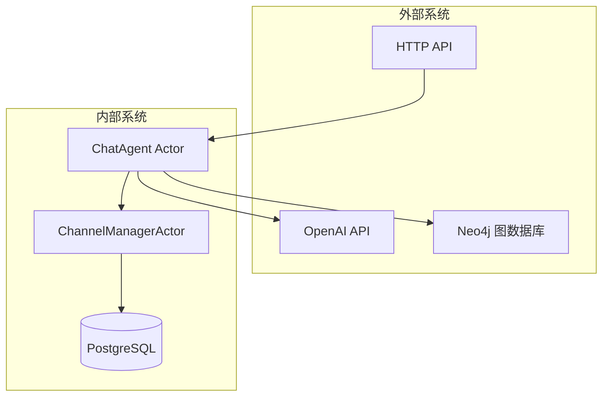
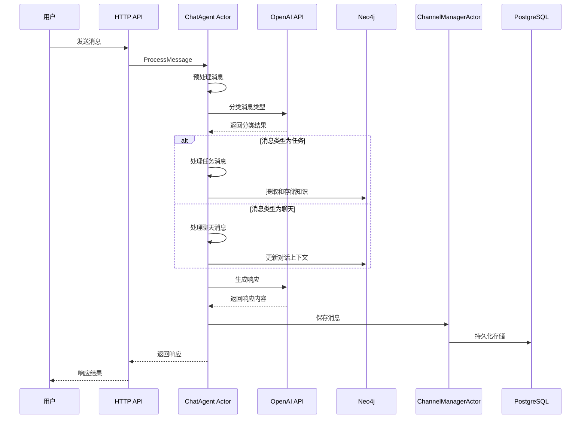

# ChatAgent Actor 架构设计文档

## 1. 架构概述

ChatAgent Actor 是基于 Actix 框架设计的智能对话代理，负责处理用户消息、进行语义分析、与 OpenAI API 交互，并管理知识图谱存储。该 Actor 采用事件驱动架构，与现有的 ChannelManagerActor 协同工作。

### 1.1 核心设计原则

- **单一职责**: 专注于消息处理和智能对话
- **异步非阻塞**: 基于 Actix Actor 模型的高并发处理
- **可扩展性**: 支持插件化的消息处理器和知识提取器
- **容错性**: 完善的错误处理和重试机制
- **状态管理**: 内部状态与外部存储分离

### 1.2 系统边界



## 2. ChatAgent Actor 核心架构

### 2.1 Actor 结构设计

```rust
pub struct ChatAgent {
    /// OpenAI 客户端
    openai_client: async_openai::Client,
    
    /// Neo4j 图数据库连接
    neo4j_pool: neo4rs::Graph,
    
    /// ChannelManager Actor 地址
    channel_manager: Addr<ChannelManagerActor>,
    
    /// 内部状态管理
    state: ChatAgentState,
    
    /// 配置信息
    config: ChatAgentConfig,
    
    /// 消息处理器注册表
    message_handlers: HashMap<MessageType, Box<dyn MessageHandler>>,
    
    /// 知识提取器
    knowledge_extractor: Box<dyn KnowledgeExtractor>,
}
```

### 2.2 内部状态管理

```rust
#[derive(Debug, Clone)]
pub struct ChatAgentState {
    /// 当前会话上下文
    session_contexts: HashMap<String, SessionContext>,
    
    /// 用户偏好设置
    user_preferences: HashMap<String, UserPreferences>,
    
    /// 处理统计信息
    processing_stats: ProcessingStats,
    
    /// 缓存的对话历史
    conversation_cache: LruCache<String, Vec<ConversationTurn>>,
}

#[derive(Debug, Clone)]
pub struct SessionContext {
    pub session_id: String,
    pub user_id: String,
    pub current_topic: Option<String>,
    pub conversation_state: ConversationState,
    pub last_activity: DateTime<Utc>,
    pub context_variables: HashMap<String, serde_json::Value>,
}

#[derive(Debug, Clone)]
pub enum ConversationState {
    Idle,
    InTask(String),
    InChat,
    WaitingForInput,
}
```

### 2.3 配置结构

```rust
#[derive(Debug, Clone, Deserialize)]
pub struct ChatAgentConfig {
    /// OpenAI API 配置
    pub openai: OpenAIConfig,
    
    /// 消息分类配置
    pub classification: ClassificationConfig,
    
    /// 知识图谱配置
    pub knowledge_graph: KnowledgeGraphConfig,
    
    /// 缓存配置
    pub cache: CacheConfig,
    
    /// 重试配置
    pub retry: RetryConfig,
}

#[derive(Debug, Clone, Deserialize)]
pub struct OpenAIConfig {
    pub api_key: String,
    pub model: String,
    pub max_tokens: u32,
    pub temperature: f32,
    pub timeout_seconds: u64,
}

#[derive(Debug, Clone, Deserialize)]
pub struct ClassificationConfig {
    pub confidence_threshold: f32,
    pub enable_auto_classification: bool,
    pub classification_prompt: String,
}
```

## 3. 消息处理流程设计

### 3.1 消息处理主流程



### 3.2 消息分类逻辑

```rust
#[derive(Debug, Clone, Serialize, Deserialize)]
pub struct MessageClassification {
    pub message_type: MessageType,
    pub confidence: f32,
    pub reasoning: String,
    pub extracted_entities: Vec<Entity>,
    pub suggested_actions: Vec<String>,
}

#[derive(Debug, Clone, Serialize, Deserialize)]
pub struct Entity {
    pub name: String,
    pub entity_type: String,
    pub confidence: f32,
    pub position: (usize, usize),
}

impl ChatAgent {
    async fn classify_message(&self, message: &str) -> Result<MessageClassification> {
        let prompt = format!(
            "{}\n\n用户消息: {}\n\n请分析这条消息并返回JSON格式的分类结果。",
            self.config.classification.classification_prompt,
            message
        );
        
        let response = self.openai_client
            .chat()
            .create(&self.build_classification_request(&prompt))
            .await?;
            
        self.parse_classification_response(&response)
    }
}
```

### 3.3 任务处理流程

```rust
#[derive(Debug, Clone, Message)]
#[rtype(result = "Result<TaskExecutionResult>")]
pub struct ProcessTaskMessage {
    pub original_message: Message,
    pub classification: MessageClassification,
    pub session_context: SessionContext,
}

#[derive(Debug, Clone, Serialize, Deserialize)]
pub struct TaskExecutionResult {
    pub task_id: String,
    pub status: TaskStatus,
    pub result: Option<serde_json::Value>,
    pub next_actions: Vec<String>,
    pub extracted_knowledge: Vec<KnowledgeItem>,
}

#[derive(Debug, Clone, Serialize, Deserialize)]
pub enum TaskStatus {
    Completed,
    InProgress,
    Failed(String),
    RequiresInput,
}
```

### 3.4 聊天处理流程

```rust
#[derive(Debug, Clone, Message)]
#[rtype(result = "Result<ChatResponse>")]
pub struct ProcessChatMessage {
    pub original_message: Message,
    pub classification: MessageClassification,
    pub session_context: SessionContext,
}

#[derive(Debug, Clone, Serialize, Deserialize)]
pub struct ChatResponse {
    pub response_id: String,
    pub content: String,
    pub response_type: ResponseType,
    pub suggested_followups: Vec<String>,
    pub updated_context: SessionContext,
}

#[derive(Debug, Clone, Serialize, Deserialize)]
pub enum ResponseType {
    Text,
    ActionRequired,
    Question,
    Information,
}
```

## 4. 知识图谱设计

### 4.1 图数据库模式

```cypher
// 用户节点
CREATE (u:User {
    id: string,
    name: string,
    preferences: map,
    created_at: datetime
})

// 会话节点
CREATE (s:Session {
    id: string,
    user_id: string,
    started_at: datetime,
    last_activity: datetime,
    current_topic: string
})

// 消息节点
CREATE (m:Message {
    id: string,
    content: string,
    message_type: string,
    timestamp: datetime,
    sentiment: float,
    entities: [string]
})

// 实体节点
CREATE (e:Entity {
    name: string,
    type: string,
    properties: map,
    confidence: float,
    first_seen: datetime
})

// 概念节点
CREATE (c:Concept {
    name: string,
    description: string,
    category: string,
    importance: float
})

// 关系定义
// 用户-会话
(u)-[:HAS_SESSION]->(s)

// 会话-消息
(s)-[:CONTAINS_MESSAGE]->(m)

// 消息-实体
(m)-[:MENTIONS]->(e)

// 实体-概念
(e)-[:IS_A]->(c)

// 实体-实体关系
(e1)-[:RELATED_TO {type: string, confidence: float}]->(e2)
```

### 4.2 知识提取器接口

```rust
#[async_trait]
pub trait KnowledgeExtractor: Send + Sync {
    async fn extract_entities(&self, message: &str) -> Result<Vec<Entity>>;
    async fn extract_concepts(&self, message: &str) -> Result<Vec<Concept>>;
    async fn extract_relationships(&self, entities: &[Entity]) -> Result<Vec<Relationship>>;
    async fn update_knowledge_graph(&self, knowledge: &KnowledgeUpdate) -> Result<()>;
}

#[derive(Debug, Clone)]
pub struct KnowledgeUpdate {
    pub session_id: String,
    pub message_id: String,
    pub entities: Vec<Entity>,
    pub concepts: Vec<Concept>,
    pub relationships: Vec<Relationship>,
}

#[derive(Debug, Clone)]
pub struct Relationship {
    pub source: String,
    pub target: String,
    pub relation_type: String,
    pub confidence: f32,
    pub properties: HashMap<String, serde_json::Value>,
}
```

## 5. 接口设计

### 5.1 ChatAgent 对外接口

```rust
// 处理用户消息
#[derive(Message)]
#[rtype(result = "Result<ChatAgentResponse>")]
pub struct ProcessUserMessage {
    pub user_message: UserMessage,
    pub session_id: Option<String>,
}

// 获取会话上下文
#[derive(Message)]
#[rtype(result = "Result<SessionContext>")]
pub struct GetSessionContext {
    pub session_id: String,
}

// 更新用户偏好
#[derive(Message)]
#[rtype(result = "Result<()>")]
pub struct UpdateUserPreferences {
    pub user_id: String,
    pub preferences: UserPreferences,
}

// 查询知识图谱
#[derive(Message)]
#[rtype(result = "Result<Vec<KnowledgeItem>>")]
pub struct QueryKnowledgeGraph {
    pub query: String,
    pub limit: Option<u32>,
}

#[derive(Debug, Clone, Serialize, Deserialize)]
pub struct ChatAgentResponse {
    pub response_id: String,
    pub content: String,
    pub response_type: ResponseType,
    pub session_id: String,
    pub processing_time: Duration,
    pub metadata: ResponseMetadata,
}

#[derive(Debug, Clone, Serialize, Deserialize)]
pub struct ResponseMetadata {
    pub message_classification: MessageClassification,
    pub extracted_knowledge: Vec<KnowledgeItem>,
    pub suggested_actions: Vec<String>,
    pub confidence_score: f32,
}
```

### 5.2 与 ChannelManagerActor 的交互

```rust
// 保存处理后的消息
#[derive(Message)]
#[rtype(result = "Result<()>")]
pub struct SaveProcessedMessage {
    pub original_message: Message,
    pub processed_response: ChatAgentResponse,
    pub classification: MessageClassification,
}

// 获取历史消息
#[derive(Message)]
#[rtype(result = "Result<Vec<Message>>")]
pub struct GetMessageHistory {
    pub session_id: String,
    pub limit: Option<u32>,
    pub before: Option<DateTime<Utc>>,
}
```

### 5.3 与图数据库的交互接口

```rust
pub struct KnowledgeGraphService {
    graph: neo4rs::Graph,
}

impl KnowledgeGraphService {
    pub async fn create_or_update_user(&self, user: &User) -> Result<()> {
        let query = "
        MERGE (u:User {id: $id})
        SET u.name = $name,
            u.preferences = $preferences,
            u.updated_at = datetime()
        ";
        
        self.graph.execute(query, params! {
            "id" => user.id,
            "name" => user.name,
            "preferences" => user.preferences
        }).await?;
        
        Ok(())
    }
    
    pub async fn store_conversation_turn(&self, turn: &ConversationTurn) -> Result<()> {
        // 存储对话轮次到图数据库
        // 包括消息、实体、关系等
    }
    
    pub async fn query_related_entities(&self, entity: &str, limit: u32) -> Result<Vec<Entity>> {
        // 查询相关实体
    }
    
    pub async fn get_user_context(&self, user_id: &str) -> Result<UserContext> {
        // 获取用户上下文信息
    }
}
```

## 6. 错误处理和容错设计

### 6.1 错误类型定义

```rust
#[derive(Debug, thiserror::Error)]
pub enum ChatAgentError {
    #[error("OpenAI API 调用失败: {0}")]
    OpenAIError(#[from] async_openai::error::OpenAIError),
    
    #[error("图数据库操作失败: {0}")]
    GraphDatabaseError(#[from] neo4rs::Error),
    
    #[error("消息分类失败: {0}")]
    ClassificationError(String),
    
    #[error("会话上下文不存在: {0}")]
    SessionNotFound(String),
    
    #[error("知识提取失败: {0}")]
    KnowledgeExtractionError(String),
    
    #[error("配置错误: {0}")]
    ConfigurationError(String),
    
    #[error("处理超时: {0}")]
    TimeoutError(String),
}
```

### 6.2 重试机制

```rust
#[derive(Debug, Clone)]
pub struct RetryConfig {
    pub max_attempts: u32,
    pub base_delay: Duration,
    pub max_delay: Duration,
    pub backoff_multiplier: f32,
    pub retryable_errors: Vec<String>,
}

impl ChatAgent {
    async fn with_retry<F, T, E>(&self, operation: F) -> Result<T, E>
    where
        F: Fn() -> Pin<Box<dyn Future<Output = Result<T, E>> + Send>>,
        E: std::fmt::Display,
    {
        let mut attempt = 0;
        let mut delay = self.config.retry.base_delay;
        
        loop {
            match operation().await {
                Ok(result) => return Ok(result),
                Err(error) => {
                    attempt += 1;
                    if attempt >= self.config.retry.max_attempts {
                        return Err(error);
                    }
                    
                    if self.should_retry(&error.to_string()) {
                        tokio::time::sleep(delay).await;
                        delay = std::cmp::min(
                            Duration::from_millis((delay.as_millis() as f32 * self.config.retry.backoff_multiplier) as u64),
                            self.config.retry.max_delay
                        );
                    } else {
                        return Err(error);
                    }
                }
            }
        }
    }
}
```

### 6.3 断路器模式

```rust
pub struct CircuitBreaker {
    state: CircuitState,
    failure_count: u32,
    failure_threshold: u32,
    recovery_timeout: Duration,
    last_failure_time: Option<Instant>,
}

#[derive(Debug, Clone)]
pub enum CircuitState {
    Closed,
    Open,
    HalfOpen,
}

impl CircuitBreaker {
    pub async fn call<F, T, E>(&mut self, operation: F) -> Result<T, E>
    where
        F: FnOnce() -> Pin<Box<dyn Future<Output = Result<T, E>> + Send>>,
    {
        match self.state {
            CircuitState::Open => {
                if self.should_attempt_reset() {
                    self.state = CircuitState::HalfOpen;
                } else {
                    return Err(/* circuit open error */);
                }
            }
            CircuitState::HalfOpen => {
                // 允许少量请求通过
            }
            CircuitState::Closed => {
                // 正常状态
            }
        }
        
        match operation().await {
            Ok(result) => {
                self.on_success();
                Ok(result)
            }
            Err(error) => {
                self.on_failure();
                Err(error)
            }
        }
    }
}
```

## 7. 性能和扩展性考虑

### 7.1 缓存策略

```rust
pub struct ChatAgentCache {
    /// 对话历史缓存
    conversation_cache: LruCache<String, Vec<ConversationTurn>>,
    
    /// 用户偏好缓存
    user_preferences_cache: LruCache<String, UserPreferences>,
    
    /// 知识图谱查询缓存
    knowledge_cache: LruCache<String, Vec<KnowledgeItem>>,
    
    /// OpenAI 响应缓存
    response_cache: LruCache<String, ChatResponse>,
}

impl ChatAgentCache {
    pub async fn get_cached_response(&self, cache_key: &str) -> Option<ChatResponse> {
        self.response_cache.get(cache_key).cloned()
    }
    
    pub async fn cache_response(&mut self, cache_key: String, response: ChatResponse) {
        self.response_cache.put(cache_key, response);
    }
}
```

### 7.2 并发处理

```rust
impl ChatAgent {
    async fn process_message_concurrently(&self, messages: Vec<ProcessUserMessage>) -> Vec<Result<ChatAgentResponse>> {
        let semaphore = Arc::new(Semaphore::new(self.config.max_concurrent_requests));
        let handles: Vec<_> = messages
            .into_iter()
            .map(|message| {
                let semaphore = semaphore.clone();
                let agent = self.clone();
                
                tokio::spawn(async move {
                    let _permit = semaphore.acquire().await.unwrap();
                    agent.process_single_message(message).await
                })
            })
            .collect();
            
        let mut results = Vec::new();
        for handle in handles {
            results.push(handle.await.unwrap());
        }
        results
    }
}
```

### 7.3 监控和指标

```rust
#[derive(Debug, Clone)]
pub struct ChatAgentMetrics {
    pub messages_processed: u64,
    pub average_processing_time: Duration,
    pub classification_accuracy: f32,
    pub openai_api_calls: u64,
    pub knowledge_graph_operations: u64,
    pub error_rate: f32,
    pub cache_hit_rate: f32,
}

impl ChatAgent {
    pub fn get_metrics(&self) -> ChatAgentMetrics {
        ChatAgentMetrics {
            messages_processed: self.state.processing_stats.messages_processed,
            average_processing_time: self.state.processing_stats.average_processing_time,
            classification_accuracy: self.state.processing_stats.classification_accuracy,
            openai_api_calls: self.state.processing_stats.openai_api_calls,
            knowledge_graph_operations: self.state.processing_stats.knowledge_graph_operations,
            error_rate: self.state.processing_stats.error_rate,
            cache_hit_rate: self.state.processing_stats.cache_hit_rate,
        }
    }
}
```

## 8. 部署和配置

### 8.1 环境配置

```toml
[chat_agent]
max_concurrent_requests = 100
session_timeout_minutes = 30
cache_size = 1000

[chat_agent.openai]
api_key = "${OPENAI_API_KEY}"
model = "gpt-4"
max_tokens = 2048
temperature = 0.7
timeout_seconds = 30

[chat_agent.classification]
confidence_threshold = 0.8
enable_auto_classification = true
classification_prompt = "请分析以下消息的类型..."

[chat_agent.knowledge_graph]
neo4j_uri = "bolt://localhost:7687"
neo4j_user = "neo4j"
neo4j_password = "${NEO4J_PASSWORD}"
max_connections = 10

[chat_agent.retry]
max_attempts = 3
base_delay_ms = 1000
max_delay_ms = 10000
backoff_multiplier = 2.0
```

### 8.2 健康检查

```rust
#[derive(Message)]
#[rtype(result = "Result<HealthStatus>")]
pub struct HealthCheck;

#[derive(Debug, Clone, Serialize, Deserialize)]
pub struct HealthStatus {
    pub status: ServiceStatus,
    pub openai_connection: bool,
    pub neo4j_connection: bool,
    pub channel_manager_connection: bool,
    pub last_check: DateTime<Utc>,
    pub uptime: Duration,
}

#[derive(Debug, Clone, Serialize, Deserialize)]
pub enum ServiceStatus {
    Healthy,
    Degraded,
    Unhealthy,
}

impl Handler<HealthCheck> for ChatAgent {
    type Result = Result<HealthStatus>;
    
    async fn handle(&mut self, _msg: HealthCheck, _ctx: &mut Self::Context) -> Self::Result {
        let openai_status = self.check_openai_connection().await.is_ok();
        let neo4j_status = self.check_neo4j_connection().await.is_ok();
        let channel_manager_status = self.channel_manager.send(HealthCheck).await.is_ok();
        
        let overall_status = match (openai_status, neo4j_status, channel_manager_status) {
            (true, true, true) => ServiceStatus::Healthy,
            (true, _, _) | (_, true, _) | (_, _, true) => ServiceStatus::Degraded,
            _ => ServiceStatus::Unhealthy,
        };
        
        Ok(HealthStatus {
            status: overall_status,
            openai_connection: openai_status,
            neo4j_connection: neo4j_status,
            channel_manager_connection: channel_manager_status,
            last_check: Utc::now(),
            uptime: self.start_time.elapsed(),
        })
    }
}
```

## 9. 总结

ChatAgent Actor 架构设计提供了一个完整、可扩展的智能对话代理解决方案。该架构具有以下特点：

1. **模块化设计**: 清晰的职责分离和接口定义
2. **高性能**: 异步处理、缓存机制和并发控制
3. **可靠性**: 完善的错误处理、重试机制和断路器模式
4. **智能化**: 基于 OpenAI API 的语义分析和知识图谱存储
5. **可观测性**: 全面的监控指标和健康检查

该架构为后续的实现提供了坚实的基础，支持系统的持续演进和功能扩展。