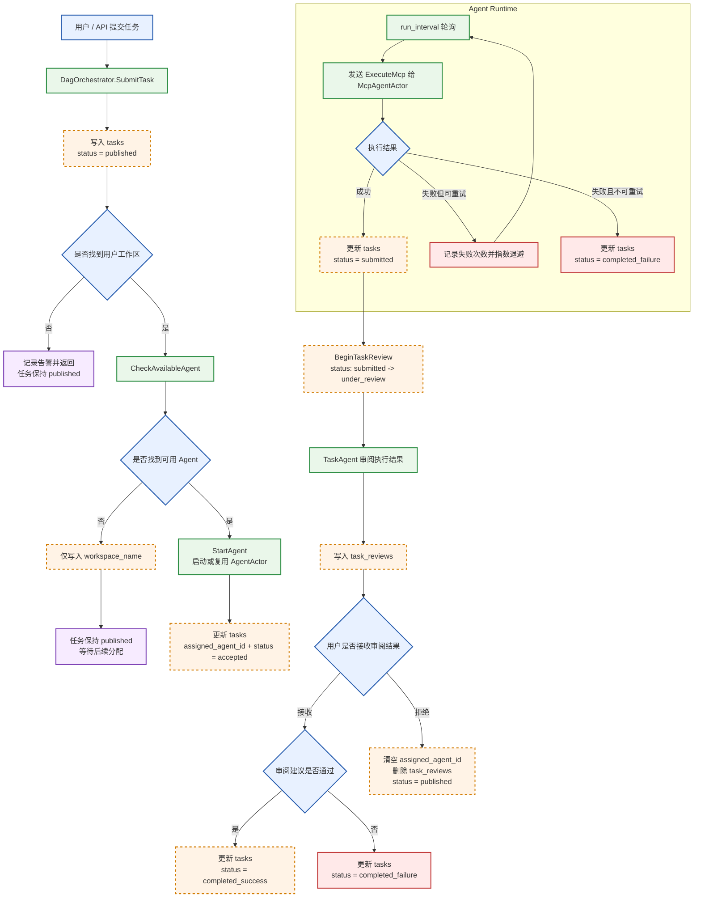

# Task Runtime Flow

这份文档按当前项目实际实现整理，覆盖任务提交、工作区绑定、Agent 执行、MCP 重试、审阅决策，以及成功/失败/回退的完整流转。

## 关键结论

1. 任务初始一定是 `published`
2. 执行成功后才会进入 `submitted` 和后续审阅
3. 执行失败且不可重试时会直接进入 `completed_failure`
4. 用户拒绝审阅结果不会直接失败，而是回到 `published`
5. submitted 有回补扫描机制，避免任务永久卡住
