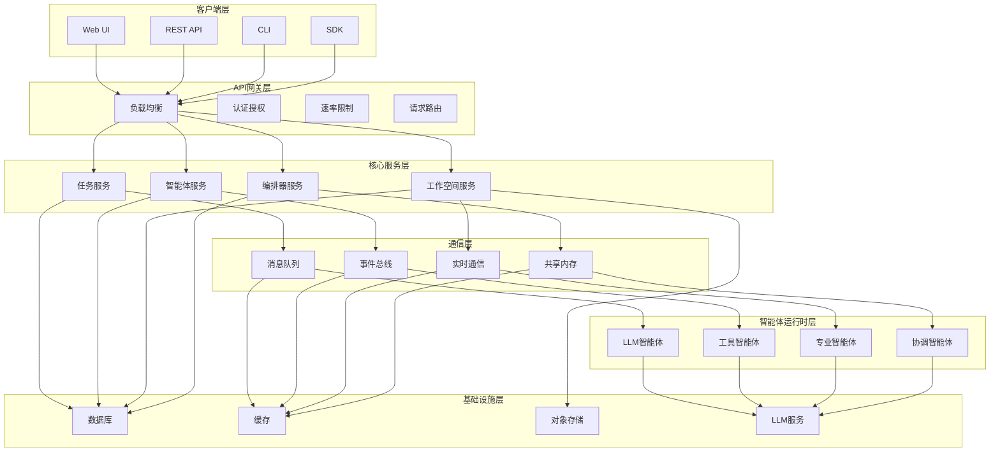

# 基于LLM的多智能体并行协作系统 - 技术规格文档

## 1. 系统概述

### 1.1 项目目标
构建一个可扩展的多智能体协作系统，支持智能体间的并行任务执行、动态协作和知识共享。

### 1.2 核心特性
- **智能体管理**: 智能体注册、发现、健康监控
- **任务编排**: 复杂任务分解、依赖管理、进度跟踪
- **协作通信**: 智能体间消息传递、状态同步
- **工作空间**: 共享上下文、工具访问、权限控制
- **可观测性**: 完整监控、日志记录、性能分析

## 2. 系统架构详细设计

### 2.1 核心组件架构



### 2.2 组件详细规格

#### 2.2.1 任务服务 (Task Service)
**职责**:
- 任务生命周期管理（创建、查询、更新、删除）
- 任务分解和依赖解析
- 进度跟踪和状态管理

**技术规格**:
- **框架**: FastAPI + Pydantic
- **数据库**: PostgreSQL (任务表、依赖表、进度表)
- **API端点**:
  - `POST /tasks` - 创建任务
  - `GET /tasks/{task_id}` - 获取任务详情
  - `PUT /tasks/{task_id}` - 更新任务状态
  - `DELETE /tasks/{task_id}` - 删除任务
  - `POST /tasks/{task_id}/decompose` - 任务分解

#### 2.2.2 智能体服务 (Agent Service)
**职责**:
- 智能体注册和发现
- 能力目录管理
- 健康检查和负载均衡

**技术规格**:
- **框架**: FastAPI + Redis
- **存储**: Redis (智能体状态), PostgreSQL (能力目录)
- **API端点**:
  - `POST /agents/register` - 智能体注册
  - `GET /agents` - 获取可用智能体
  - `GET /agents/{agent_id}/capabilities` - 获取智能体能力
  - `POST /agents/{agent_id}/heartbeat` - 健康检查

#### 2.2.3 工作空间服务 (Workspace Service)
**职责**:
- 共享上下文管理
- 工具和资源访问
- 权限控制和审计

**技术规格**:
- **框架**: FastAPI + MongoDB
- **存储**: MongoDB (文档、上下文), MinIO (文件存储)
- **API端点**:
  - `POST /workspaces` - 创建工作空间
  - `GET /workspaces/{workspace_id}/context` - 获取上下文
  - `POST /workspaces/{workspace_id}/documents` - 上传文档
  - `GET /workspaces/{workspace_id}/tools` - 获取可用工具

#### 2.2.4 编排器服务 (Orchestrator Service)
**职责**:
- 工作流定义和执行
- 智能体选择和调度
- 冲突解决和协调

**技术规格**:
- **框架**: FastAPI + Celery
- **工作流引擎**: Custom DSL + State Machine
- **API端点**:
  - `POST /workflows` - 创建工作流
  - `POST /workflows/{workflow_id}/execute` - 执行工作流
  - `GET /workflows/{workflow_id}/status` - 获取工作流状态
  - `POST /workflows/{workflow_id}/cancel` - 取消工作流

## 3. 数据模型设计

### 3.1 核心数据模型

#### 3.1.1 任务模型 (Task)
```python
class Task(BaseModel):
    id: UUID
    title: str
    description: str
    status: TaskStatus  # PENDING, IN_PROGRESS, COMPLETED, FAILED
    priority: Priority  # LOW, MEDIUM, HIGH, URGENT
    created_at: datetime
    updated_at: datetime
    parent_task_id: Optional[UUID]  # 父任务ID
    dependencies: List[UUID]  # 依赖任务列表
    assigned_agent: Optional[UUID]  # 分配的智能体
    result: Optional[Dict]  # 任务结果
    metadata: Dict[str, Any]  # 元数据
```

#### 3.1.2 智能体模型 (Agent)
```python
class Agent(BaseModel):
    id: UUID
    name: str
    description: str
    capabilities: List[Capability]  # 能力列表
    status: AgentStatus  # ONLINE, OFFLINE, BUSY, IDLE
    current_load: int  # 当前负载
    max_concurrent_tasks: int  # 最大并发任务数
    last_heartbeat: datetime  # 最后心跳时间
    metadata: Dict[str, Any]  # 元数据
```

#### 3.1.3 工作空间模型 (Workspace)
```python
class Workspace(BaseModel):
    id: UUID
    name: str
    description: str
    context: Dict[str, Any]  # 共享上下文
    documents: List[Document]  # 文档列表
    tools: List[Tool]  # 可用工具
    permissions: Dict[str, List[str]]  # 权限配置
    created_at: datetime
    updated_at: datetime
```

#### 3.1.4 消息模型 (Message)
```python
class Message(BaseModel):
    id: UUID
    timestamp: datetime
    sender: UUID  # 发送者ID
    recipients: List[UUID]  # 接收者列表
    message_type: MessageType  # TASK_ASSIGNMENT, STATUS_UPDATE, COLLABORATION_REQUEST
    payload: Dict[str, Any]  # 消息内容
    priority: Priority  # 消息优先级
    ttl: Optional[int]  # 生存时间（秒）
```

## 4. 通信协议设计

### 4.1 消息格式标准

#### 4.1.1 任务分配消息
```json
{
  "message_id": "uuid",
  "timestamp": "2024-01-01T00:00:00Z",
  "sender": "orchestrator_id",
  "recipients": ["agent_id"],
  "message_type": "TASK_ASSIGNMENT",
  "payload": {
    "task_id": "task_uuid",
    "task_description": "任务描述",
    "requirements": {
      "capabilities": ["writing", "analysis"],
      "timeout": 300,
      "max_retries": 3
    },
    "context": {
      "workspace_id": "workspace_uuid",
      "relevant_documents": ["doc1", "doc2"]
    }
  }
}
```

#### 4.1.2 状态更新消息
```json
{
  "message_id": "uuid",
  "timestamp": "2024-01-01T00:00:00Z",
  "sender": "agent_id",
  "recipients": ["orchestrator_id"],
  "message_type": "STATUS_UPDATE",
  "payload": {
    "task_id": "task_uuid",
    "status": "IN_PROGRESS",
    "progress": 50,
    "estimated_completion": "2024-01-01T00:05:00Z",
    "current_step": "正在分析数据",
    "issues": []
  }
}
```

#### 4.1.3 协作请求消息
```json
{
  "message_id": "uuid",
  "timestamp": "2024-01-01T00:00:00Z",
  "sender": "agent_id",
  "recipients": ["other_agent_id"],
  "message_type": "COLLABORATION_REQUEST",
  "payload": {
    "request_type": "INFORMATION_REQUEST",
    "task_id": "task_uuid",
    "question": "需要关于X的信息",
    "urgency": "HIGH",
    "response_deadline": "2024-01-01T00:02:00Z"
  }
}
```

### 4.2 通信通道

#### 4.2.1 同步通信 (HTTP/REST)
- 用于任务分配、状态查询等需要立即响应的操作
- 技术栈: FastAPI + Uvicorn
- 超时配置: 默认30秒

#### 4.2.2 异步通信 (Redis Pub/Sub)
- 用于事件通知、状态广播等异步操作
- 技术栈: Redis + aioredis
- 消息持久化: 可选，通过Redis Streams

#### 4.2.3 实时通信 (WebSocket)
- 用于实时协作、进度更新等场景
- 技术栈: FastAPI WebSocket + Channels
- 连接管理: 自动重连、心跳检测

## 5. 扩展性设计

### 5.1 水平扩展策略

#### 5.1.1 服务无状态化
- 所有服务设计为无状态
- 会话状态存储在Redis中
- 使用JWT进行认证

#### 5.1.2 数据分片策略
- **按工作空间分片**: 不同工作空间的数据分布在不同的数据库实例
- **按用户分片**: 用户数据按用户ID哈希分片
- **智能体池**: 动态增减智能体实例应对负载变化

#### 5.1.3 负载均衡
- **API网关**: Nginx负载均衡
- **智能体调度**: 基于能力的加权轮询算法
- **数据库**: 读写分离 + 连接池

### 5.2 性能优化

#### 5.2.1 缓存策略
- **L1缓存**: 内存缓存 (热点数据)
- **L2缓存**: Redis缓存 (会话、状态)
- **L3缓存**: CDN缓存 (静态资源)

#### 5.2.2 连接池
- **数据库连接池**: 使用asyncpg连接池
- **Redis连接池**: aioredis连接池
- **HTTP客户端**: aiohttp连接池

#### 5.2.3 批处理优化
- **LLM API批处理**: 合并多个请求减少API调用
- **数据库批量操作**: 使用批量插入/更新
- **消息批量发送**: 合并小消息减少网络开销

## 6. 容错和可靠性

### 6.1 故障处理机制

#### 6.1.1 重试策略
- **指数退避**: 失败后等待时间指数增长
- **最大重试次数**: 可配置，默认3次
- **重试条件**: 网络错误、服务不可用、限流

#### 6.1.2 断路器模式
- **状态**: CLOSED, OPEN, HALF_OPEN
- **阈值**: 失败率超过50%时打开断路器
- **恢复**: 30秒后尝试半开状态

#### 6.1.3 优雅降级
- **主要功能**: 任务执行、智能体协作
- **降级功能**: 只提供基本任务执行，暂停复杂协作
- **备用方案**: 本地模型替代云端LLM

### 6.2 数据一致性

#### 6.2.1 最终一致性
- 大多数场景使用最终一致性
- 异步消息确保状态同步
- 冲突解决使用版本控制

#### 6.2.2 补偿事务
- 关键操作失败时执行补偿
- 记录操作日志用于回滚
- 支持手动干预和自动恢复

#### 6.2.3 幂等性设计
- 所有API操作支持重复执行
- 使用唯一ID防止重复处理
- 状态机确保操作顺序

## 7. 安全设计

### 7.1 认证授权

#### 7.1.1 用户认证
- **OAuth 2.0**: 支持第三方登录
- **JWT令牌**: 无状态认证
- **API密钥**: 服务间认证

#### 7.1.2 权限控制
- **RBAC**: 基于角色的访问控制
- **工作空间权限**: 读、写、管理权限
- **智能体权限**: 工具访问、数据访问权限

#### 7.1.3 审计日志
- **操作审计**: 记录所有用户操作
- **安全事件**: 记录认证失败、权限拒绝等
- **合规性**: 支持GDPR、CCPA等法规

### 7.2 数据安全

#### 7.2.1 传输安全
- **TLS 1.3**: 所有通信加密
- **证书管理**: 自动证书续期
- **密钥轮换**: 定期更换加密密钥

#### 7.2.2 静态加密
- **数据库加密**: 敏感字段加密存储
- **文件加密**: 上传文件自动加密
- **密钥管理**: 使用HSM或KMS

#### 7.2.3 隐私保护
- **数据脱敏**: 敏感信息自动脱敏
- **访问控制**: 细粒度数据访问权限
- **数据保留**: 自动清理过期数据

## 8. 部署架构

### 8.1 开发环境

#### 8.1.1 本地开发
```yaml
# docker-compose.yml
services:
  postgres:
    image: postgres:15
    environment:
      POSTGRES_DB: agent_system
      POSTGRES_USER: developer
      POSTGRES_PASSWORD: password
    
  redis:
    image: redis:7
    
  api:
    build: .
    ports:
      - "8000:8000"
    depends_on:
      - postgres
      - redis
```

#### 8.1.2 CI/CD流水线
- **代码检查**: pre-commit hooks
- **自动化测试**: pytest + coverage
- **容器构建**: Docker multi-stage build
- **部署**: GitHub Actions + Kubernetes

### 8.2 生产环境

#### 8.2.1 容器化部署
- **基础镜像**: python:3.11-slim
- **多阶段构建**: 减小镜像大小
- **健康检查**: HTTP健康检查端点
- **资源限制**: CPU、内存限制

#### 8.2.2 Kubernetes编排
```yaml
# deployment.yaml
apiVersion: apps/v1
kind: Deployment
metadata:
  name: agent-system
spec:
  replicas: 3
  selector:
    matchLabels:
      app: agent-system
  template:
    metadata:
      labels:
        app: agent-system
    spec:
      containers:
      - name: api
        image: agent-system:latest
        ports:
        - containerPort: 8000
        resources:
          requests:
            memory: "256Mi"
            cpu: "250m"
          limits:
            memory: "512Mi"
            cpu: "500m"
```

#### 8.2.3 云原生架构
- **服务网格**: Istio for traffic management
- **配置管理**: ConfigMaps + Secrets
- **服务发现**: Kubernetes DNS
- **自动扩缩**: HPA based on CPU/Memory

### 8.3 监控运维

#### 8.3.1 指标收集
- **应用指标**: Prometheus metrics
- **业务指标**: 任务成功率、智能体利用率
- **性能指标**: 响应时间、吞吐量

#### 8.3.2 日志管理
- **结构化日志**: JSON格式日志
- **日志聚合**: ELK Stack
- **日志轮转**: 自动清理旧日志

#### 8.3.3 告警系统
- **监控告警**: Prometheus AlertManager
- **业务告警**: 任务失败、智能体离线
- **通知渠道**: Email、Slack、Webhook

## 9. 技术栈选择

### 9.1 核心技术栈

| 组件 | 技术选择 | 理由 |
|------|----------|------|
| 后端框架 | FastAPI | 异步支持好，自动文档生成 |
| 数据库 | PostgreSQL + Redis | 关系型+缓存，成熟稳定 |
| 消息队列 | Redis Pub/Sub + Celery | 简单高效，易于扩展 |
| 容器化 | Docker | 行业标准，生态丰富 |
| 编排 | Kubernetes | 生产级容器编排 |
| 监控 | Prometheus + Grafana | 云原生监控标准 |

### 9.2 开发工具链

| 工具 | 用途 | 配置 |
|------|------|------|
| pre-commit | 代码检查 | black, isort, flake8 |
| pytest | 单元测试 | 覆盖率>80% |
| mypy | 类型检查 | 严格模式 |
| docker-compose | 本地开发 | 多服务编排 |
| GitHub Actions | CI/CD | 自动化部署 |

## 10. 演进路线

### 10.1 阶段1: MVP (4-6周)
- 基本任务执行流程
- 简单智能体通信
- 基础用户界面
- 核心API实现

### 10.2 阶段2: 增强版 (8-12周)
- 高级工作流支持
- 智能体能力市场
- 性能优化和扩展
- 监控和告警系统

### 10.3 阶段3: 企业版 (12-16周)
- 多租户支持
- 高级安全特性
- 与现有系统集成
- 生产级运维工具

---

*此技术规格文档为系统实现提供详细指导，所有组件设计都考虑了可扩展性、可靠性和安全性。*