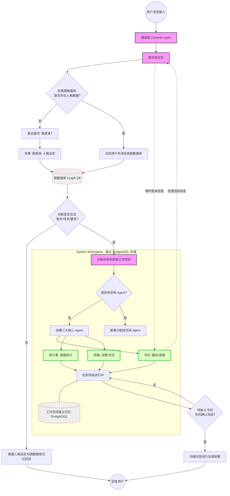

```mermaid
{: id="20260307170031-4pt0vc6"}

graph TD
    %% 定义样式
    classDef layer fill:<span data-type="tag">f9f,stroke:</span>​333,stroke-width:2px;
    classDef database fill:<span data-type="tag">eee,stroke:</span>​f66,stroke-width:2px,stroke-dasharray: 5 5;
    classDef agent fill:<span data-type="tag">00ff0022,stroke:</span>​00aa00,stroke-width:2px;
{: id="20260307170135-zhsi2pd"}

    %% 1. 通道与人格处理层
    Start((用户消息输入)) --> Channel[通道层 Channel Layer]
    Channel --> ChatLayer[聊天层交互]
{: id="20260307170135-upuxvqu"}

    ChatLayer --> CheckPersonality{检索图数据库: 
是否存在人格数据?}
{: id="20260307170135-at2mp02"}

    %% 人格设定分支
    CheckPersonality -- 否 --> AskWho[提出疑问: 我是谁?]
    AskWho --> SetPersonality[完善 '我是谁' 人格设定]
    SetPersonality --> UpdateGraph[(图数据库 Graph DB)]
{: id="20260307170135-buu5kmn"}

    %% 用户识别分支
    CheckPersonality -- 是 --> IDUser[识别用户并添加至图数据库]
    IDUser --> UpdateGraph
{: id="20260307170135-xbkva78"}

    UpdateGraph --> CheckTask{判断是否包含:
指令/任务/要求?}
{: id="20260307170135-1igctly"}

    %% 纯聊天分支
    CheckTask -- 否 --> ChatReply[根据人格设定与图数据库记忆回话]
    ChatReply --> UserEnd((回复用户))
{: id="20260307170135-ygq6ae7"}

    %% 2. 任务执行与工作空间层
    CheckTask -- 是 --> AssignTask[分配任务到系统工作空间]
{: id="20260307170135-9wtbv9e"}

    subgraph Workspace [System Workspace - 独立 PostgreSQL 存储]
        AssignTask --> CheckIdle{是否有空闲 Agent?}
{: id="20260307170135-u7126ce"}

        %% 创建 Agent
        CheckIdle -- 否 --> CreateAgents[创建三大核心 Agent]
        CreateAgents --> Sec[书记: 建议/进度]
        CreateAgents --> Exe[执行者: 直接执行]
        CreateAgents --> Lead[领袖: 决策/方向]
{: id="20260307170135-njlrj39"}

        CheckIdle -- 是 --> Dispatch[直接分配给空闲 Agent]
{: id="20260307170135-1s0e4ch"}

        Sec --> TaskLoop[任务持续进行中]
        Exe --> TaskLoop
        Lead --> TaskLoop
{: id="20260307170135-1lsj0sm"}

        TaskLoop --- PG[(工作空间独立记忆: PostgreSQL)]
    end
{: id="20260307170135-ibd8uic"}

    %% 进度查询逻辑
    ChatLayer -.->|随时查询进度| Sec
    Sec -.->|反馈当前状态| ChatLayer
{: id="20260307170135-n8qng6n"}

    %% 完成逻辑
    TaskLoop --> Completion{领袖 & 书记
共同确认完成?}
    Completion -- 否 --> TaskLoop
    Completion -- 是 --> FinalFeedback[向聊天层进行反馈结果]
    FinalFeedback --> UserEnd
{: id="20260307170135-idqc45l"}

    %% 样式指派
    class Channel,ChatLayer,AssignTask layer;
    class UpdateGraph,PG database;
    class Sec,Exe,Lead agent;
{: id="20260307170135-3tokb1d"}

```
{: id="20260307170147-p0j08xg"}

这是一个非常清晰且具有逻辑深度的多智能体架构。我为你绘制了对应的 Mermaid 流程图，你可以直接将以下代码复制到 <span data-type="strong">思源笔记</span>、<span data-type="strong">Logseq</span> 或 <span data-type="strong">VS Code</span> 中查看。
{: id="20260307170218-rh4f7by"}

为了清晰起见，我将整个流程分为 <span data-type="strong">“聊天与人格识别层”</span> 以及 <span data-type="strong">“工作空间任务执行层”</span> 两个部分。
{: id="20260307170218-pe0x8p5"}


{: id="20260307170218-f6bksop"}

### 流程逻辑解析：
{: id="20260307170218-3w2btfy"}

1. {: id="20260307170218-tlyh23d"}<span data-type="strong">双层架构隔离</span>：
   {: id="20260307170218-l3u5c85"}

   - {: id="20260307170218-genw0ms"}<span data-type="strong">聊天层（Chat Layer）</span>：负责情感、人格、记忆检索和用户交互。使用<span data-type="strong">图数据库</span>处理复杂的实体关系（我是谁、你是谁、我们的关系）。
     {: id="20260307170218-vgr8tbx"}
   - {: id="20260307170218-nsiv2t7"}<span data-type="strong">工作空间层（Workspace）</span>：负责重逻辑的生产任务。使用 <span data-type="strong">PostgreSQL</span> 存储结构化的任务执行日志和独立记忆。
     {: id="20260307170218-4ofhl1n"}
   {: id="20260307170218-07svda2"}
2. {: id="20260307170218-k2xg2v4"}<span data-type="strong">人格冷启动</span>：
   {: id="20260307170218-kys8udw"}

   - {: id="20260307170218-u76sk9z"}系统具备“自我意识”检查，如果图数据库中没有定义当前人格，它会通过“我是谁？”的交互完成初始化，这是非常有意思的自演化逻辑。
     {: id="20260307170218-scu1hw0"}
   {: id="20260307170218-20eu7lg"}
3. {: id="20260307170218-a3pv86v"}<span data-type="strong">核心三智能体模型</span>：
   {: id="20260307170218-xma2ghu"}

   - {: id="20260307170218-gz2pkum"}<span data-type="strong">书记（Secretary）</span>：不仅提供建议，还充当了聊天层与执行层之间的“沟通桥梁”，负责进度汇报。
     {: id="20260307170218-urp0r9m"}
   - {: id="20260307170218-pyao0bm"}<span data-type="strong">执行者（Executor）</span>：专注技术实现和任务执行。
     {: id="20260307170218-lvo8xva"}
   - {: id="20260307170218-dg2fi4o"}<span data-type="strong">领袖（Leader）</span>：掌握决策权和最终质量闸门。
     {: id="20260307170218-f4h109s"}
   {: id="20260307170218-7jz3jzy"}
4. {: id="20260307170218-dd7cezl"}<span data-type="strong">双重确认机制</span>：
   {: id="20260307170218-rjvgp66"}

   - {: id="20260307170218-0p7cmsb"}任务的结束不是单方面的，而是由<span data-type="strong">领袖（决策位）</span>与<span data-type="strong">书记（审核/记录位）</span>共同判定，确保了任务完成的质量和逻辑闭环。
     {: id="20260307170218-tmeakyl"}
   {: id="20260307170218-0x5vy7j"}
{: id="20260307170218-qw0etpe"}

### 如何在你的 Markdown 工具中使用：
{: id="20260307170218-q4pr1i5"}

1. {: id="20260307170218-djdqkyl"}安装支持 Mermaid 的编辑器（如 <span data-type="strong">思源笔记</span>）。
   {: id="20260307170218-8b0gf92"}
2. {: id="20260307170218-8ok0zd3"}新建一个代码块，语言选择 <span data-type="code">mermaid</span>​。
   {: id="20260307170218-5cxx4uk"}
3. {: id="20260307170218-wxky3gf"}粘贴上面的代码，即可看到精美的彩色流程图。
   {: id="20260307170218-bxzsep1"}
{: id="20260307170218-a5c85n7"}

{: id="20260307170031-mtebxa3" title="工作Mermaid 流程图" type="doc"}