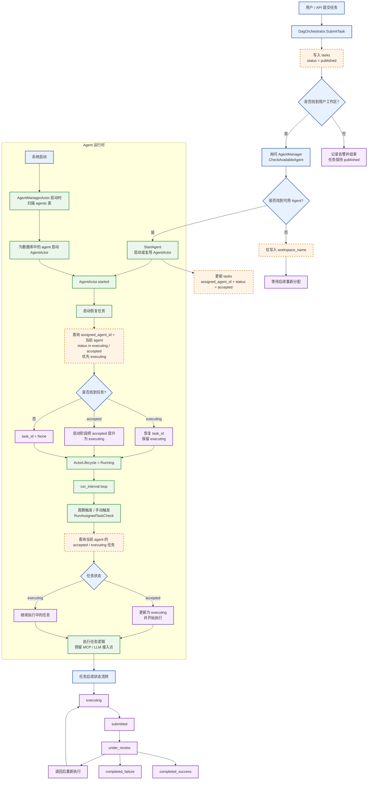

# 工作 Mermaid 流程图

这份图按当前项目代码实现整理，重点覆盖任务提交、Agent 分配、启动恢复、运行轮询和任务状态流转。

## 当前实现要点

1. 任务初始写入数据库时状态是 published。
2. 找到可用 Agent 后，DagOrchestrator 会先确保 AgentActor 已启动，再把任务更新为 accepted。
3. AgentActor 启动时会优先恢复 executing 任务；如果没有 executing，就会查 accepted，并在启动阶段直接提升为 executing。
4. Agent 进入 Running 后会进入周期 loop，持续触发 RunAssignedTaskCheck。
5. loop 中会查询 assigned_agent_id 对应的 accepted 和 executing 任务；accepted 会被推进到 executing。
6. mcp_agent_actor 和 open_aiproxy_actor 已在 Agent loop 中预留，可继续接入具体执行逻辑。

## 和旧图相比的主要修正

1. 去掉了固定三大核心 Agent 作为主流程，因为当前代码里的 Agent 类型实际是 general、code、research、custom。
2. 补上了真实的任务状态链路：published → accepted → executing → submitted → under_review → completed_success / completed_failure。
3. 补上了系统启动恢复逻辑：AgentManager 会扫描 agents 表，把数据库中的 AgentActor 恢复到内存。
4. 补上了 AgentActor 的启动恢复逻辑和 Running loop，这部分是当前实现里最关键的运行时机制。

## MCP 执行计划

### 目标链路

1. AgentActor 发现当前任务需要执行。
2. AgentActor 发送 ExecuteMcp 给 McpAgentActor。
3. McpAgentActor 内部完成完整 MCP 流程：
    - 选工具
    - 如果没有工具则创建工具
    - 生成工具参数
    - 使用工具
    - 解释工具结果
    - 返回结构化结果
4. AgentActor 根据返回结果判断：
    - 成功
    - 失败
    - 是否要重试
    - 是否推进任务状态

### 职责划分

#### AgentActor

AgentActor 只负责任务调度与任务状态推进，不负责 MCP 内部细节。核心职责如下：

1. 检测当前是否存在可执行任务。
2. 在任务进入执行阶段后，调用 McpAgentActor。
3. 接收 McpAgentActor 返回的结构化结果。
4. 根据结果判断任务是否成功、失败、是否需要重试，以及是否推进到下一个任务状态。

#### McpAgentActor

McpAgentActor 负责完整的 MCP 执行闭环，不把工具执行细节暴露给 AgentActor。核心职责如下：

1. 根据任务内容和上下文选择最合适的工具。
2. 如果当前没有可用工具，则进入工具创建流程。
3. 基于任务目标和工具定义生成调用参数。
4. 实际执行 MCP 工具。
5. 对工具返回结果进行解释、整理与结构化。
6. 返回统一的执行结果给 AgentActor。

### 推荐执行链路

AgentActor
-> ExecuteMcp
-> McpAgentActor
-> 选工具
-> 无工具则创建工具
-> 生成参数
-> 执行工具
-> 解释结果
-> 返回结构化结果
-> AgentActor 判定是否成功并推进状态

### 返回结果要求

McpAgentActor 返回结果应尽量结构化，至少要能支持 AgentActor 做以下判断：

1. 本次执行是否成功。
2. 失败原因是什么。
3. 是否适合立即重试。
4. 工具原始输出是什么。
5. 工具解释后的结果是什么。
6. 当前任务是否已经达到可提交条件。

### 后续实现顺序

1. 先补全 ExecuteMcp 的请求与响应结构。
2. 再实现 McpAgentActor 内部的工具选择与工具创建逻辑。
3. 然后实现参数生成、工具执行、结果解释。
4. 最后由 AgentActor 基于返回结果接入任务状态推进逻辑。
